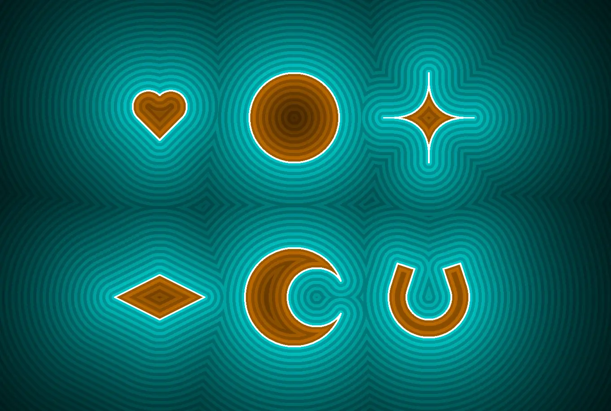

# Audio Reactive Visualizations Using Machine Learning and a Custom FPGA Ray Marching GPU

*By Michael Crum (mmc323@cornell.edu) and Antti Meriluoto (ahm234@cornell.edu)*


## Introduction

In a tradition as old as time, sights and sounds are often paired together to induce emotion in the observer.
Incredible reactions can be created with careful pairings of the two, although the exact relation between image and audio is, as with many things distinctly human, difficult to pin down precisely.
Of course, this difficulty only seems to make the challenge more appealing to creatives, scientists, and all varieties of people in between.

For our final project, we chose to attempt a unique approach to the problem, utilizing the skills and tools we learned during the class to create visual interpretations of songs.
We used machine learning to extract emotional meaning from the music, which in turn impacted the ray marched visuals generated on the FPGA.
In this write-up, we will summarize the various techniques used to realize our final product.

## Results

Although it’s somewhat unconventional to show results at the beginning of the write-up, seeing the final product might help you visualize what we’re going on about in the following sections.
All visuals are generated in real time on the FPGA.

<iframe src="https://www.youtube.com/embed/r3ks_tyS-WY?si=1HaImeeaQmbGLfbe" title="YouTube video player" frameborder="0" allow="accelerometer; autoplay; clipboard-write; encrypted-media; gyroscope; picture-in-picture; web-share" referrerpolicy="strict-origin-when-cross-origin" allowfullscreen></iframe>

<iframe src="https://www.youtube.com/embed/videoseries?si=JtC5gJRozmR-BWEw&amp;list=PLmn5J0zkYYOtlyqh27yB4OJvCweu7AEqI" title="YouTube video player" frameborder="0" allow="accelerometer; autoplay; clipboard-write; encrypted-media; gyroscope; picture-in-picture; web-share" referrerpolicy="strict-origin-when-cross-origin" allowfullscreen></iframe>

## Sentiment Analysis

Setting up a model to predict the sentiment of a given song primarily involved two different development procedures: application development and machine learning engineering. In this section, we will provide an overview of the various components involved in designing the Python application that ultimately served as the user interface for the project. 

### Spotify Web Development API

We decided that the accessibility and usability of a streaming based API would provide an effective framework to build up our app. We opted to use the Spotify for Web Development API as we are both routine users of Spotify and the API provides a simple interface for querying songs and playlists. We leveraged the Spotipy python library, which is the python implementation of the Spotify Web Dev API. The most convenient functionality offered by Spotify’s API was the ability to query a song and extract a set of features from Spotify’s database which quantified various aspects of a song’s musical signature. A combination of these features were what we used to generate the input vectors for our model.

Another convenient feature of Spotify’s Web Dev API was the ability to query entire playlists worth of tracks. Because of this feature, we decided to create a public Spotify playlist that would encompass our training data. We assembled this playlist by compiling a list of around 421 songs that we were familiar with, thus enabling us to relatively easily assign emotional labels to songs. 

Before attempting to train our first classification model, we needed to extract our training data and store it longterm, thus avoiding the need to repeatedly make calls to the API, which turned out to be quite a bottleneck on the development process. A number of times throughout the development process, we accidentally exceeded the query limit enforced by the Spotify API and were cut off from making queries for indeterminate amounts of time. To avoid this, we wrote a library that used the OpenPyxl Python library to store data from playlists into a spreadsheet that we could later access. 

### Initial Attempts at Training a Model

Once our training dataset was stored in a .xlsx format, we went through and added an additional column to our spreadsheet that contained the emotions we associated with each song. Originally, we opted for five emotional categories: Anxious, Depressed, Bittersweet, Angry, Happy. We used 10 musical features provided by Spotify to train our initial models : acousticness, danceability, energy, valence, instrumentalness, key, loudness, mode, speechiness, and tempo. We gained a lot of direction for this segment of the project from this link on Medium.

To train our model, we created a three-layer MLP using Pytorch, with a hidden layer of variable width. We used a ReLU function as our activation function. We used Cross-Entropy as our loss function. Originally our model was incapable of meaningfully classifying any song, and we surmised that this was due to a combination of reasons related to how we set up the task. First, the features we extracted from the API were not scaled properly when used as inputs. Some of the features had ranges that far exceeded other features, so it was probable that our model was overfitting to such features in the input space. Once we scaled every feature to belong to the same range (floats in the range of [0.0, 1.0]), we still noticed that the model was struggling to classify songs according to our categories. We reasoned that it was best to minimize the complexity of the task, get a model working, then upscale the complexity once a satisfactory baseline was achieved. 

We decided to cut the input space down to what we qualitatively surmised to be the two most meaningful features, energy and valence, and the output space down to a simple binary classification task. After training a linear classification model that could categorize songs into two emotional categories, positive and negative, with an approximately 70% test accuracy, we decided to try to scale up the complexity of the task to something more interesting. 

### Final Model Overview

After an extended process of experimentation with different labeling schemes, finetuning various hyperparameters such as learning rates, the number of training epochs, the size of the hidden layer, and the number of hidden layers, and introducing new features to the input space, we ultimately created a model that we deemed satisfactory for a demonstration’s sake. The model achieved about an 85% test accuracy classifying songs into three emotional categories: Happy, Sad, and Angry. 

In the end, we used a three layer MLP with an input size of 2, a hidden layer of width 10, and an output size of 3. The two features we utilized were energy and valence since these seemed to have the highest correlation with song emotions. 

### Designing a User Interface

The final requirement for the Python side of the project was designing the user interface. This required a simple GUI, which we implemented using TKInter, and a communication protocol between the app and the process running on the HPS. The GUI we designed in the end includes a button that prompts the user to update the song being visualized. We instantiate an instance of a Spotipy object using the login credentials of a user, in this case, Antti, which in turn lets us call a function to query the song the user is currently playing. This in turn enables the online functionality of the project, as we use this call to extract the features from a currently played song, perform a forward pass through our trained model, then communicate the outputted emotion, along with the energy feature of the song, to the HPS. The predicted emotion and the energy feature combined enabled us to create 6 different visual configurations for our custom GPU. 

We experimented with a number of different designs for the communication protocol between the Python process and the HPS, but we ultimately decided to use SFTP since it was simple to implement. Once we set up SSH keys between the PC hosting the app and the SoC, each click of the button on the GUI would perform a remote file transfer of a .txt file containing the aforementioned information. On the HPS side, we use this information to configure the visuals in accordance with the emotional signature of the currently playing song by communicating it over to the FPGA using PIO connections over the Lightweight AXI Bus. 

## FPGA-Based Raymarching GPU

### The ray marching algorithm

For brevity, this section will offer an abridged description of the raymarching algorithm.
If you wish to learn more about the algorithm, Michael [has written a full article about it on his website](https://michael-crum.com/raymarching/) (with pretty demos too!).

Raymarching is a form of [physically based rendering](https://en.wikipedia.org/wiki/Physically_based_rendering): rendering techniques that model the interaction of lights and physical objects to emulate real-world vision.
Because emulating billions of photons emitted from light sources is intractable, physically based rendering techniques instead work backward to trace the path of photons that ultimately end up hitting the camera (or eye, depending on how you prefer to think of it).

At a base level, the goal of rendering is to assign a color to each screen pixel.
Think of your screen as a window.
Through the window is the scene we wish to render, made up of simple shapes.
The screen/window can be quantized by its pixels, each specifying a unique coordinate on the window.
For light from the scene to enter your eye, it must pass through one of these pixels in the window.
Suppose we calculate the vector from your eye through each pixel on the window.
We can then use this vector to work backward and determine information about the photons that would enter through that pixel.
From this information, we can determine the color of that pixel.
Figure X visualizes this process for one pixel.


_Figure X: From pixels to rays (Credit: [Michael Walczyk](https://michaelwalczyk.com/blog-ray-marching.html))_

The process is well-researched in computer graphics and is computed using the inverse [camera projection matrix](https://en.wikipedia.org/wiki/Camera_matrix).
For our virtual camera, this operation boils down to just a couple of operations:

```
vec2 xy = coordinate.xy - resolution.xy / 2.0;
float z = resolution.y / tan(radians(field_of_view) / 2.0);
vec3 view_direction = normalize(vec3(xy, -z));
```

With per-pixel rays calculated, we can begin tracing them backward into the scene.
The first challenge is determining where a ray intersects the scene.
One approach is to analytically compute the ray-scene intersection.
This is the basis of ray tracing, but this computation is expensive and scales poorly with the scene's complexity.
For use on the resource-constrained FPGA, we need to be a bit more clever.

Enter ray marching, an iterative solution for computing ray-scene intersections.
The key abstraction of the ray marching algorithm is the signed distance field (SDF).
An SDF is a function that takes in a point in space and returns the distance from the point to a scene.
To illustrate the concept I will use 2D SDFs, but they trivially extend to 3D space.
The simplest 2D SDF is a circle located at the origin.
The calculation is trivial:

```

return length(point) - radius;

```

Such distance functions exist for all manner of primitives, both 2D and 3D (see Figure X).




_Figure X: Raymarched primitives_

Ray marching leverages SDFs to know how far it can **safely** step along a ray without intersecting with the scene.
The process is as follows:

1. Set point $p$ at the camera origin.
2. Evaluate SDF to find minimum distance $d$ from the scene.
    1. If $d < \epsilon$ (some small number), you’ve hit the scene
    2. Else continue
3. Step $d$ units along the ray, ie $p += ray * d$
4. Goto 1

It's important to notice that step 3 is **guaranteed** to not set $p$ inside of an object.
Because $p$ starts in free space, and $d$ is the minimum distance to the scene along _any_ direction, stepping along _any ray by $d$ will cause the new distance to be >= 0.
If the ray does intersect with the scene, $d$ will converge to zero, and the algorithm will register the point as an intersection.
Figure X illustrates the algorithm on a 2D scene.
Each blue point is $p$ after some number of iterations, and each circle represents $d$ evaluated at $p$ for each iteration.

<iframe src="https://michael-crum.com/ThreeJS-Raymarcher/2d_demo.html" title="2D Demo" style="visibility: visible;"></iframe>

_Figure X: 2D ray marching demo_

SDFs of multiple objects can be combined simply by taking the minimum of their individual SDFs.
Similar operations exist for intersection and difference.
SDFs can also be deformed to scale, rotate, twist, and repeat the SDF throughout space.
I won’t go over all of the operations here, but I’ll leave[ this excellent reference on the topic](https://iquilezles.org/articles/distfunctions/).

Ray marching outperforms ray tracing in situations where SDFs are more efficient to compute than analytic intersections.
Being an iterative solution, it is also well suited to be broken up into multiple clock cycles on the FPGA.
Notice also that each pixel is computed completely independently, perfect for massive parallelization.
This is the exact purpose of a GPU and the reason they are so valuable for graphical applications.


### Floating point and vector math on an FPGA

To have any hope at running the ray marching algorithm, we need a fractional representation that will run on the FPGA.
The traditional solution to this problem is using a fixed-point representation, but this comes with trade-offs either in magnitude or precision.
Because ray marching operates over a wide range of magnitudes, fixed-point was off the table.
We instead decided to use the [1.8.18 floating-point implementation](https://people.ece.cornell.edu/land/courses/ece5760/DE1_SOC/HPS_peripherials/Floating_Point_index.html) written by past students and improved by Bruce Land.
This gives an impressive range both for low-magnitude precision, important for normalized vectors, and high-magnitude representation, important for rendering objects at long range.

To simplify many repeated operations in our Verilog, we wrote a vector math library utilizing floating point math.
The library can be found in vector_ops.v in the appendix and includes dot products, scalar multiplication, addition, and 3x3 matrix multiplication.


### Prototyping and verification

Before launching into a full Verilog implementation, we created a reference implementation in GLSL (OpenGL Shading Language).
GLSL is a C-like language specifically for writing shaders (programs that run per pixel on the GPU).
The GLSL implementation is only 100 lines and can be found in the appendix under fractal frag.
We used this reference implementation to render the Serpinski pyramid fractal (Figure X).


_Figure X: Serpinski pyramid rendered with GLSL_

After verifying the GLSL design, we moved on to Verilog.
Because compiling code for the FPGA takes many minutes, we looked for a simulation tool that could show VGA output without lengthy Quartus compile times.
We found the tool [Verilator](https://verilator.org/guide/latest/), which compiles Verilator source code into multithreaded C++ object files.
The Verilated source code can then be linked against and the output of the model can be passed into any C++ functions of our choosing.
We used [SDL](https://github.com/libsdl-org/SDL) to render the output VGA of our model directly to a screen buffer, which can then be rendered into a window.
This [webpage from Project F](https://projectf.io/posts/verilog-sim-verilator-sdl/) was a great resource for setting up the system.
Simulating this way allowed us to render 2-3 frames per second, far from real-time but many times faster than a full Quartus compile.
Using this strategy we were able to quickly iterate on the design and fix bugs many times more efficiently than in previous labs.
See Figure X for an example of Verilated VGA output.


_Figure X: Output of Verilated model rendered with SDL_


### Architecture

Our ray-marching GPU uses a pipeline architecture to concurrently calculate dozens of pixels simultaneously.
The first step for any pixel is calculating its corresponding ray using the equations detailed in the background section.
From there, the pixel and ray components are passed into the first ray-marching core.
Each ray marching core is responsible for one iteration of the ray marching algorithm.
Because the algorithm itself takes up multiple clock cycles and the SDF evaluation can take up many more, the entire core operates as a long pipeline.
One pixel/ray combo is passed in per clock cycle, and, once per clock cycle, the core spits out the same pixel and ray information coupled with a new value of $p$.
The cores can be chained together to achieve multiple stages of iteration per clock cycle.


_Figure X: Simplified pipeline architecture_

The number of cores that can be chained together is dependent on the available hardware on the FPGA.
Because calculating more complicated SDFs takes additional hardware, the number of stages is also inversely proportional to the complexity of the scene.
For simple scenes (e.g. a single cube), up to six cores can be chained together.
This drops to three or even two for more interesting scenes and quickly becomes detrimental to the quality of the rendering.
Truthfully, even a six-iteration ray marcher offers subpar rendering results, as shown in figure X.


_Figure X: A "cube" rendered with six iterations_

To do better the architecture must be revised to allow pixels to reenter the pipeline if they need further refinement.
With this strategy, each pixel/ray is evaluated in the last core to see if it has intersected the scene.
If it has, a new pixel is pushed into the pipeline and a global pixel index is incremented to represent the next pixel in line.
If it has not intersected with the scene yet, it is fed back into the first core, and the pixel index is not incremented.
This way pixels can take multiple rides through the pipeline according to their needs.


_Figure X: Updated pipeline architecture_

This architecture provides an unbounded number of iterations to the pixels that need them, allowing for much crisper and more detailed renders.
It also provides a variable refresh rate, where low-effort pixels can continue getting rerendered while high-effort pixels render more slowly in the background.
This gives the illusion of snappy responsiveness during camera movement while allowing for high detail on close inspection.
As a final benefit, it allows for rendering high-complexity scenes that would otherwise require too many resources to render in a single pipeline.


_Figure X: A much better cube rendered with variable iterations per pixel_

### Handling Pipelines Without Going Insane

The floating point library I used requires two cycles for a floating point add and five cycles for an inverse square root.
This introduced pipelining requirements all over the project in order to keep relevant data available at the correct cycle.
Hand writing each pipeline stage would be infurating and error prone, so we adopted a system that to handle pipeline registers for us using generate statements. As an example:

```
module FP_sqrt #(
    parameter PIPELINE_STAGES = 4
) (
    input i_clk,
    input [26:0] i_a,
    output [26:0] o_sqrt
);
    wire [26:0] inv_sqrt;
    reg  [26:0] i_a_pipe [PIPELINE_STAGES:0];
    FpInvSqrt inv_sq (
        .iCLK(i_clk),
        .iA(i_a),
        .oInvSqrt(inv_sqrt)
    );
    FpMul recip (
        .iA(inv_sqrt),
        .iB(i_a_pipe[PIPELINE_STAGES]),
        .oProd(o_sqrt)
    );
    genvar i;
    generate
        for (i = 0; i < PIPELINE_STAGES; i = i + 1) begin : g_ray_pipeline
            always @(posedge i_clk) begin
                i_a_pipe[0] = i_a;
                i_a_pipe[i+1] <= i_a_pipe[i];
            end
        end
    endgenerate
endmodule
```

This snippet creates a series of pipeline registers of length `PIPELINE_STAGES`, and pushes data through the pipeline on each clock cycle.
This is required because input `i_a` will be updated every cycle, and will have a new value by the time `FpInvSqrt`'s output becomes valid for use in the multiply.
This snippet is a trivial example, but the system was crucial for other parts of the code that must pipeline up to ten diffent values.

### Pixel to Ray

As mentioned in the background section, the ray corresponding to a pixel can be calculated in the following way:

```
vec2 xy = coordinate.xy - resolution.xy / 2.0;
float z = resolution.y / tan(radians(field_of_view) / 2.0);
vec3 ray = normalize(vec3(xy, -z));
```

This assumes a camera that always looks straight forward, however, which is a bit boring. To spice things up, we added a [look at matrix](https://medium.com/@carmencincotti/lets-look-at-magic-lookat-matrices-c77e53ebdf78). Because the camera movement will be computed on the HPS, we computed the matrix in C and transfered it over PIO to the FPGA.

```
vec2 xy = coordinate.xy - resolution.xy / 2.0;
float z = resolution.y / tan(radians(FIELD_OF_VIEW) / 2.0);
vec3 ray = lookAt(
    -camera_pos,
    vec3(0.0, 0.0, 0.0),
    vec3(0.0, 1.0, 0.0)
) * normalize(vec3(xy, -z));
```

At first glance these operations seem intimidating the execute on an FPGA, specifically the divisions and tan operation.
However, `resolution` and `field_of_view` are both constant, so anything involving them can be precomputed. In fact, the entire `z` assignment boils down to a constant.
All other operations are linear, and can be computed with the vector math library we created. Calculating a ray takes 9 cycles, but is pipelined. Here's what the operation looks like in Verilog:

```
wire signed [`CORDW:0] x_signed, y_signed, x_adj, y_adj;
assign x_signed = {1'b0, i_x};
assign y_signed = {1'b0, i_y};

assign x_adj = x_signed - (`SCREEN_WIDTH >> 1);
assign y_adj = y_signed - (`SCREEN_HEIGHT >> 1);
wire [26:0] x_fp, y_fp, z_fp, res_x_fp, res_y_fp;
Int2Fp px_fp (
    .iInteger({{5{x_adj[`CORDW]}}, x_adj[`CORDW:0]}),
    .oA(x_fp)
);
Int2Fp py_fp (
    .iInteger({{5{y_adj[`CORDW]}}, y_adj[`CORDW:0]}),
    .oA(y_fp)
);
Int2Fp calc_res_x_fp (
    .iInteger(`SCREEN_WIDTH),
    .oA(res_x_fp)
);
Int2Fp calc_res_y_fp (
    .iInteger(`SCREEN_HEIGHT),
    .oA(res_y_fp)
);
FpMul z_calc (
    .iA(res_y_fp),
    .iB(`FOV_MAGIC_NUMBER),
    .oProd(z_fp)
);
wire [26:0] x_norm_fp, y_norm_fp, z_norm_fp;
VEC_normalize hi (
    .i_clk(i_clk),
    .i_x(x_fp),
    .i_y(y_fp),
    .i_z(z_fp),
    .o_norm_x(x_norm_fp),
    .o_norm_y(y_norm_fp),
    .o_norm_z(z_norm_fp)
);
wire [26:0] z_neg_fp;
FpNegate negate_z (
    .iA(z_norm_fp),
    .oNegative(z_neg_fp)
);
VEC_3x3_mult oh_god (
    .i_clk(i_clk),
    .i_m_1_1(look_at_1_1),
    .i_m_1_2(look_at_1_2),
    .i_m_1_3(look_at_1_3),
    .i_m_2_1(look_at_2_1),
    .i_m_2_2(look_at_2_2),
    .i_m_2_3(look_at_2_3),
    .i_m_3_1(look_at_3_1),
    .i_m_3_2(look_at_3_2),
    .i_m_3_3(look_at_3_3),
    .i_x(x_norm_fp),
    .i_y(y_norm_fp),
    .i_z(z_neg_fp),
    .o_x(o_x),
    .o_y(o_y),
    .o_z(o_z)
);
```

From here on out we won't show full verilog functions, instead showing block diagrams of their functions.
If you're interested in the full code, you can find it on [Michael’s GitHub page](https://github.com/usedhondacivic/fractal_gpu).

### Ray marching core

The ray marching core is build from the following GLSL model:

```
rayInfo raymarch() {
    vec3 dir = getPixelRay();
    float depth = MIN_DIST;
    for (int i = 0; i < MAX_MARCHING_STEPS; i++) {
        float dist = sceneSDF(u_camera + depth * dir);
        if (dist < EPSILON) {
            return rayInfo(vec3(1.0, 1.0, 1.0)));
        }
        depth += dist;
        if (depth >= MAX_DIST) {
            return rayInfo(vec3(0.0, 0.0, 0.0));
        }
    }
    return rayInfo(vec3(0.0, 0.0, 0.0));
}
```

The main pain point here is the sheer number of inputs that need to be pipelined and kept in synchronization. 
Between ray marching cores, each of which represents one iteration of the for loop, we must keep track of: 

* current point (x, y, z)
* current depth
* pixel location (x, y)
* ray corresponding to that pixel (x, y, z)

On top of that, the SDF has a variable pipeline length depending on the scene, so the whole system has to be parameterized based on that quantity.
The following block diagram ignores those details, but you can find the gory details [in the code base](https://github.com/usedhondacivic/fractal_gpu/blob/main/verilator/raymarcher.v).


_Figure X: Diagram of a raymarching core._

### SDFs

When calculating an SDF is similar to the other math in this write up, and a large collection of equations [can be found here](https://iquilezles.org/articles/distfunctions/).
To show how different the hardware requirements for two primatives can be, here's the block diagrams for a sphere vs a cube:


_Figure X: Diagram of a sphere's SDF._


_Figure X: Diagram of a cube's SDF._

As mentioned in the background section, SDF's can also be combined. This, once again, becomes tricky with pipelining.
It is crutial that the faster SDF in the operation (in terms of clock cycles till a valid output) is pipelined to match the latency of the slower SDF.
We used module parameters to make our operations robust to this:

```verilog
box BOX (
    .clk(clk),
    .point_x(a_x),
    .point_y(a_y),
    .point_z(a_z),
    .dim_x(`ONE),
    .dim_y(`ONE),
    .dim_z(`ONE),
    .distance(cube_dist)
);
sphere BALL (
    .clk(clk),
    .point_x(a_x),
    .point_y(a_y),
    .point_z(a_z),
    .radius(`ONE_POINT_THREE),
    .distance(sphere_dist)
);
sdf_difference #(
    .SDF_A_PIPELINE_CYCLES(9),
    .SDF_B_PIPELINE_CYCLES(11),
) DIFF (
    .clk(clk),
    .i_dist_a(sphere_dist),
    .i_dist_b(cube_dist),
    .o_dist(distance)
);
```


_Figure X: A cube with a sphere subtracted from it._

Verilog code for all of the SDFs I used and some basic operations (union, difference) [can be found here](https://github.com/usedhondacivic/fractal_gpu/tree/main/verilator/sdf).

### Color calculation and the VGA driver

The ray marching pipeline outputs general information about the scene, but another step is required to translate that information into a pixel color.
We abstracted this mapping into a module that takes in a distance from the ray marcher, and outputs a color.
This is a rather simplistic system, and most ray marching renderers utilize other information like iterations before converence, surface normals, and material ID's to decide on a final color.
For our application however, we decided it was best to keep it simple.

To choose the color of a pixel, the floating point distance is shifted left by a certain amount for each color channel.
The float is then converted into an int, and the lower bits are taken as value for that color.
The shift amount is a parameter read over PIO, allowing the HPS to change the mood of the render through adjustments to the periodicity of each color.
For additional control, we also have flags to selectively turn off each channel.

## Bugs, issues, and future work

This project was really pushed the FPGA to it's limits, and it unsuprisingly began to come appart at the seams.
This is evident when you watch the demos of some more complicated scenes, and notice the intense artifacting.
Because simulation shows much better results, we believe this has something to do with violating the timing constraints of the FGPA fabric, although there are likely several bugs in our code.

In terms of the MLP, there were a number of shortcomings associated with the architecture. For starters, it is difficult to meaningfully classify every song into just 3 emotional categories since this leaves little room for ambiguity. In addition, the two input features, though they provide an excellent means of discerning the emotional flavor of a song, are not infallible. Valence is a quantity assigned to reflect the positivity of the lyrical content of a song, however, in certain cases, a song might somewhat erroneously have a high valence feature, thus leading the model to assign more positivity to it. 

There are a few ways we could try to circumvent these issues. For the purposes of the demonstration, we sacrificed model complexity for higher test accuracy. With enough time and experimentation, it could be possible to create a model that classifies songs into a larger set of categories without sacrificing its performance. Moreover, certain additional features which we did not incorporate into our final model like key could play a huge role in discerning the emotional content of a song. 

Nonetheless, the project was ideated as a way of conveying emotion through mixed media, and glitches or not, we think it was very effective at achieving that goal.

## Appendix

### Permissions

The group approves this report for inclusion on the course website.

The group approves the video for inclusion on the course youtube channel.

### Code listing

[Complete source code](https://github.com/usedhondacivic/fractal_gpu/tree/main/verilator/sdf)

### Specific Tasks

Michael:

* Prototyping and development of the GPU's Verilog
* Integration testing with the FPGA
* Camera controls and movement sequences

Antti:

* Train and deploy machine learning model to perform sentiment anaylsis on songs
* Apply the model to affect models and movement within the graphics module to evoke the appropriate emotion for the song

### References
